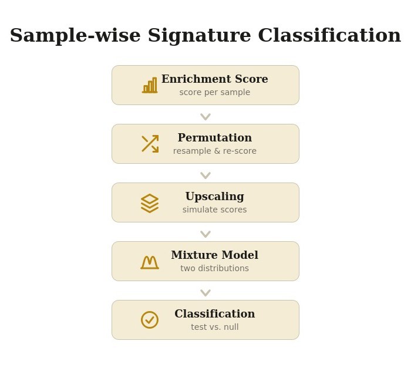

```{r style, echo = FALSE, results = 'asis', message = FALSE}
BiocStyle::markdown()
suppressPackageStartupMessages({
  library(knitr)
})
```

<br />

**Package**: `r Rpackage("splitTypeR")`<br />
**Authors**: `r packageDescription("splitTypeR")[["Author"]]`<br />
**Version**: `r packageDescription("splitTypeR")$Version`<br />
**Compiled date**: `r Sys.Date()`<br />
**License**: `r packageDescription("splitTypeR")[["License"]]`<br />

# Licensing and citing

This package and the underlying `r Rpackage("splitTypeR")` code are 
distributed under the Artistic license 2.0. You are free to use and 
redistribute this software.

If you use this package for a publication, we would ask you to cite the 
following:

>  Deschênes A, Belleau P (2026). _splitTypeR: Transcriptomic classification using mixture of normal distributions_. R package version 0.99.0,
  <https://github.com/adeschen/splitTypeR>.

<br />

# Introduction

Cancer classification, using RNA sequencing, is now part of modern precision 
oncology. For some cancers, RNA classification provides deep insights into 
tumor aggressiveness and growth rates. For example, breast cancer subtypes 
(like Luminal-A, Luminal-B, HER2-enriched, or Basal-like) help forecast 
patient outcomes [@Cascianelli2020]. The Luminal-A is the most 
common molecular subtype of breast cancer, making up to 60% of all breast 
cancer cases. It also is associated with good prognosis. While 
Luminal-B tumors have a more aggressive phenotype and a worse 
prognosis [@Yersal2014]. Once gene signatures for RNA subtyping become 
widly accepted by major oncology organizations, they start to classify cancer 
subtypes, predict patient survival, and guide treatment.

From a research aspect, the classification of new samples using their 
transcriptional profiles can be done using different tools. For some cancers, 
machine learning models and dedicated software are available such as 
the Bioconductor Genefu package for breast cancer molecular 
subtyping [@Gendoo2016], and the CMScaller package for subtyping of 
colorectal cancer [@Eide2017].

In the absence of dedicated software, unsupervised clustering with a 
heatmap visualization to classify transcriptomic samples with a 
gene signature is often employed. This method is relatively simple and 
offers an instant visual support. However, this method has a few drawbacks:

* _Lack of statistical metrics_: It doesn't 
provide a statistical probability score for a sample's class assignment; it 
mainly acts as a visual summary. 
* _Metric sensitivity_: Changing the clustering metric (ex: from "Euclidean" to 
"Pearson" distance) can alters the resulting clusters. 
* _Outlier distortion_: Extreme outliers can squash the color scale, and 
artificially create skewed subsets.

The __`r Rpackage("splitTypeR")`__ package resolves these issues by providing 
an automated statistical framework to classify heterogeneous biological 
samples based on gene signature lists, effectively isolating the 
signature-positive samples. 

This classification method is designed for bulk transcriptomic datasets.

<br />

# Installation

As with any R package, the `r Rpackage("splitTypeR")` package should first be 
loaded with the following command:

```{r loadingPackage, warning=FALSE, message=FALSE}
library(splitTypeR)
```

<br />

# Method
  
This following figure represent the statistical method employ to turn a noisy, 
single-number enrichment score into a confident binary classification of each sample. In summary, the method builds a confidence interval around the 
enrichment score, models the cohort as a mixture of two biological states, and 
then statistically tests each sample against that mixture.


```{r piplineSchema, echo=FALSE, fig.align='center', out.width="100%", fig.cap="General workflow."}

```
<br />

The statistical method is split into 5 steps. Each of those steps are 
performed for one specific signature at the time. A signature is typically a predefined set of features (transcriptomic expression in this situation) that is associated with some biological state, pathway, or phenotype.


## Enrichment score

The enrichment scores are first computed for every single sample 
with the Bioconductor GSVA package [@Hanzelmann2013]. Those scores represent 
the real score for each sample. Later steps treats this real score as the 
anchor point around which uncertainty gets modeled.

## Permutation

Random subsets of samples, of fixed size, from the full dataset are 
repetitively drawn. For each of these resampled subsets, the enrichment score 
for the samples present are recomputed.

This step enables a per-sample uncertainty estimation (standard deviation).

## Upscaling 

For each sample, a fixed number of simulated enrichment scores are drawn 
from a normal distribution centered on the real score, using the standard 
deviation estimated from permutations.

This step enables the upscaling of the total number of values that will 
be used in the next step. 

## Mixture model

The synthetic values across all samples are pooled to fit two overlapping 
normal distributions to them. The two normal distributions are extracted using 
a mixture model approach implemented in the mixtools package [@JSSv032i06]. 
The idea being that the whole cohort is actually a blend of two underlying populations (a "low enrichment" group and a "high enrichment" group). 
 

## Classification

For each sample, a hypothesis testing whether its real score is more consistent with belonging to the low-enrichment distribution or the high-enrichment one, and assign it accordingly.

For each sample, the pipeline runs a hypothesis test where the Null 
hypothesis (H₀) is that the sample actually belongs to the lower-enrichment distribution. The sample's real enrichment score (from Step 1) is checked 
against that null distribution. If the real score is implausible under the low-enrichment distribution (i.e., it falls somewhere that distribution would rarely produce), the null hypothesis is rejected. In that situation, the sample 
is classified as belonging to the higher-enrichment group which implies it is 
assigned to the tested signature. Otherwise, the samples is not classified. 

<br />


# Demonstration

For this demonstration, we are going to use the published RNA-seq dataset of 
pancreatic ductal adenocarcinoma (PDAC) patients-derived organoids (PDOs) 
published in Tiriac et al. [@Tiriac2018]. The RNA-seq has been aligned with 
GENCODE v48 on GRCh38.p14 genome with STAR v2.7.9a [@Dobin2013]. Only one
PDO per patient was retained. The expected 
counts were processed with DESeq2 v1.50.2 [@Love2014] on genes expressed in at 
least 20% of the PDOs. The normalized expression is available in a 
_SummarizedExperiment_ object. 

In PDAC, the basal-like and classical subtypes, as defined in Moffitt et al. [@Moffitt2015], are the two consistently employed molecular subtypes. The 
classical signature is associated to better prognosis and better response to standard chemotherapy while the basal-like subtype is associated 
with worse overall prognosis [@Moffitt2015, @OKane2020].

```{r expCount}


```


# Acknowledgment

Claude Sonnet 5 was used for improving the workflow figure. It was also use for 
proofreading and copyediting sections of this text.

# Session info

Here is the output of `sessionInfo()` on the system on which this document was 
compiled:

```{r sessionInfo, echo=FALSE}
sessionInfo()
```

